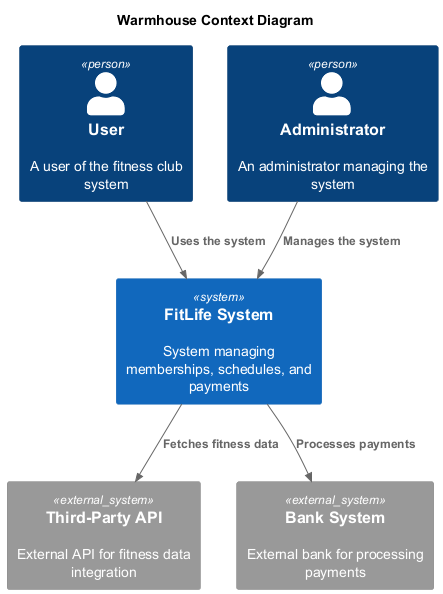

# Project_template

Это шаблон для решения проектной работы. Структура этого файла повторяет структуру заданий. Заполняйте его по мере работы над решением.

# Задание 1. Анализ и планирование


### 1. Описание функциональности монолитного приложения

**Управление отоплением:**

- Пользователи могут могут удалённо включать/выключать отопление в своих домах.
- Система поддерживает включение/выключение тепмературы через веб-интерфейс пользователями. 
- Система поддерживает добавление, изменение и удаление датчиков администратором.

**Мониторинг температуры:**

- Пользователи могут удалённо просматривать текущую температуру в своих домах.
- Система поддерживает просмотр температуры через веб-интерфейс пользователями.
- Система поддерживает добавление, изменение и удаление датчиков администратором.

### 2. Анализ архитектуры монолитного приложения

- **Язык программирования:** Go
- **База данных:** PostgreSQL
- **Архитектура:** Монолитная, все компоненты системы (обработка запросов, бизнес-логика, работа с данными) находятся в рамках одного приложения.
- **Взаимодействие:** Синхронное по http, запросы обрабатываются последовательно.
- **Масштабируемость:** Ограничена, так как монолит сложно масштабировать по частям.
- **Развертывание:** Требует остановки всего приложения.

### 3. Определение доменов и границы контекстов

- **Домен: управление Умным домом**
  - поддомен управления устройствами
    - контекст управления датчиками температуры 
  - поддомен мониторинга
    - контекст мониторинга датчиков температуры

### **4. Проблемы монолитного решения**

#### 1. Трудности расширения и модернизации
Монолитная система сложнее развивать и поддерживать, поскольку любое новое устройство или новый функционал потребует изменения всего существующего программного продукта.
#### 2. Низкая отказоустойчивость
При сбоях одной части системы вся платформа становится недоступной, так как компоненты тесно связаны друг с другом.
#### 3. Невозможность горизонтального масштабирования
#### 4. Проблемы производительности
Отсутствие асинхронных операций означает, что каждый запрос обрабатывается последовательно, задерживая выполнение последующих запросов.
#### 5. Высокая сложность тестирования и деплоймента
Тестирование монолитного приложения занимает больше времени и ресурсов, потому что тестируется весь продукт целиком, а не отдельные сервисы. Каждое развертывание новой версии влечет необходимость остановки всей системы, что создает дополнительные сложности и риски для бизнеса.
#### 6. Сложность добавления новых пользователей
Отсутствие возможностей самостоятельного подключения, требуется установка специального оборудования. 

### 5. Визуализация контекста системы — диаграмма С4



# Задание 2. Проектирование микросервисной архитектуры

В этом задании вам нужно предоставить только диаграммы в модели C4. Мы не просим вас отдельно описывать получившиеся микросервисы и то, как вы определили взаимодействия между компонентами To-Be системы. Если вы правильно подготовите диаграммы C4, они и так это покажут.

**Диаграмма контейнеров (Containers)**

Добавьте диаграмму.

**Диаграмма компонентов (Components)**

Добавьте диаграмму для каждого из выделенных микросервисов.

**Диаграмма кода (Code)**

Добавьте одну диаграмму или несколько.

# Задание 3. Разработка ER-диаграммы

Добавьте сюда ER-диаграмму. Она должна отражать ключевые сущности системы, их атрибуты и тип связей между ними.

# Задание 4. Создание и документирование API

### 1. Тип API

Укажите, какой тип API вы будете использовать для взаимодействия микросервисов. Объясните своё решение.

### 2. Документация API

Здесь приложите ссылки на документацию API для микросервисов, которые вы спроектировали в первой части проектной работы. Для документирования используйте Swagger/OpenAPI или AsyncAPI.

# Задание 5. Работа с docker и docker-compose

Перейдите в apps.

Там находится приложение-монолит для работы с датчиками температуры. В README.md описано как запустить решение.

Вам нужно:

1) сделать простое приложение temperature-api на любом удобном для вас языке программирования, которое при запросе /temperature?location= будет отдавать рандомное значение температуры.

Locations - название комнаты, sensorId - идентификатор названия комнаты

```
	// If no location is provided, use a default based on sensor ID
	if location == "" {
		switch sensorID {
		case "1":
			location = "Living Room"
		case "2":
			location = "Bedroom"
		case "3":
			location = "Kitchen"
		default:
			location = "Unknown"
		}
	}

	// If no sensor ID is provided, generate one based on location
	if sensorID == "" {
		switch location {
		case "Living Room":
			sensorID = "1"
		case "Bedroom":
			sensorID = "2"
		case "Kitchen":
			sensorID = "3"
		default:
			sensorID = "0"
		}
	}
```

2) Приложение следует упаковать в Docker и добавить в docker-compose. Порт по умолчанию должен быть 8081

3) Кроме того для smart_home приложения требуется база данных - добавьте в docker-compose файл настройки для запуска postgres с указанием скрипта инициализации ./smart_home/init.sql

Для проверки можно использовать Postman коллекцию smarthome-api.postman_collection.json и вызвать:

- Create Sensor
- Get All Sensors

Должно при каждом вызове отображаться разное значение температуры

Ревьюер будет проверять точно так же.


